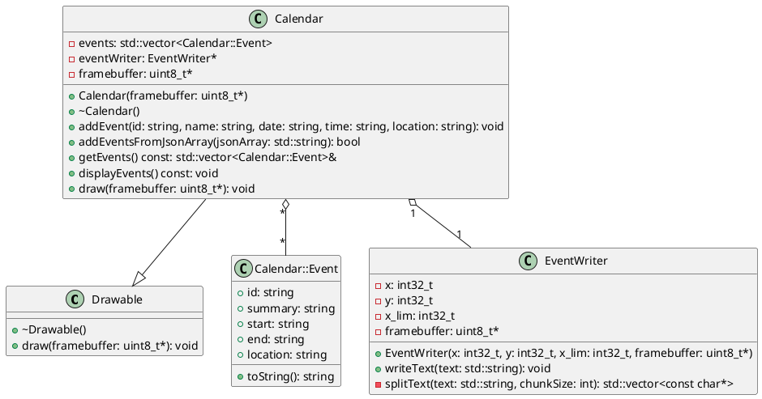

```plantuml
@startuml
class Drawable {
  +~Drawable()
  +draw(framebuffer: uint8_t*): void
}

class "Calendar::Event" as CalendarEvent {
  +id: string
  +summary: string
  +start: string
  +end: string
  +location: string
  +toString(): string
}

class Calendar {
  -events: std::vector<Calendar::Event>
  -eventWriter: EventWriter*
  -framebuffer: uint8_t*
  +Calendar(framebuffer: uint8_t*)
  +~Calendar()
  +addEvent(id: string, name: string, date: string, time: string, location: string): void
  +addEventsFromJsonArray(jsonArray: std::string): bool
  +getEvents() const: std::vector<Calendar::Event>&
  +displayEvents() const: void
  +draw(framebuffer: uint8_t*): void
}

class EventWriter {
  -x: int32_t
  -y: int32_t
  -x_lim: int32_t
  -framebuffer: uint8_t*
  +EventWriter(x: int32_t, y: int32_t, x_lim: int32_t, framebuffer: uint8_t*)
  +writeText(text: std::string): void
  -splitText(text: std::string, chunkSize: int): std::vector<const char*>
}

Calendar --|> Drawable
Calendar "1" o-- "1" EventWriter
Calendar "*" o-- "*" CalendarEvent
@enduml
```
