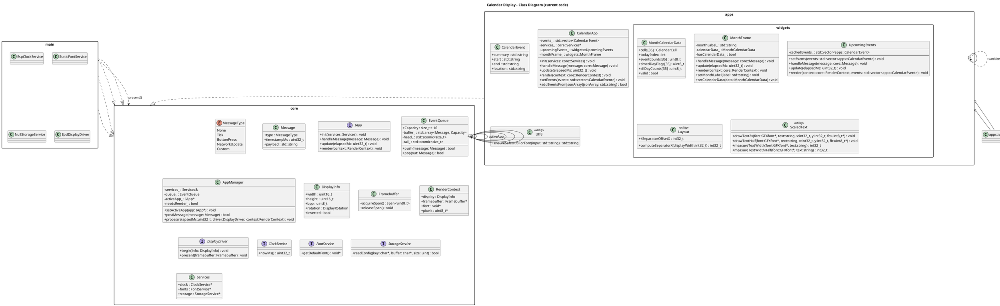

# UML Class Diagram 1.0

```plantuml
@startuml
title Calendar Display – Class Diagram (current code)

skinparam packageStyle rect
skinparam classAttributeIconSize 0

package core {
  enum MessageType {
    None
    Tick
    ButtonPress
    NetworkUpdate
    Custom
  }

  class Message {
    +type : MessageType
    +timestampMs : uint32_t
    +payload : std::string
  }

  interface IApp {
    +init(services: Services) : void
    +handleMessage(message: Message) : void
    +update(elapsedMs: uint32_t) : void
    +render(context: RenderContext) : void
  }

  class EventQueue {
    +Capacity : size_t = 16
    -buffer_ : std::array<Message, Capacity>
    -head_ : std::atomic<size_t>
    -tail_ : std::atomic<size_t>
    --
    +push(message: Message) : bool
    +pop(out: Message) : bool
  }

  class AppManager {
    -services_ : Services&
    -queue_ : EventQueue
    -activeApp_ : IApp*
    -needsRender_ : bool
    --
    +setActiveApp(app: IApp*) : void
    +postMessage(message: Message) : bool
    +process(elapsedMs:uint32_t, driver:DisplayDriver, context:RenderContext) : void
  }

  class DisplayInfo {
    +width : uint16_t
    +height : uint16_t
    +bpp : uint8_t
    +rotation : DisplayRotation
    +inverted : bool
  }

  class Framebuffer {
    +acquireSpan() : Span<uint8_t>
    +releaseSpan() : void
  }

  class RenderContext {
    +display : DisplayInfo
    +framebuffer : Framebuffer*
    +font : void*
    +pixels : uint8_t*
  }

  interface DisplayDriver {
    +begin(info: DisplayInfo) : void
    +present(framebuffer: Framebuffer) : void
  }

  interface ClockService {
    +nowMs() : uint32_t
  }

  interface FontService {
    +getDefaultFont() : void*
  }

  interface StorageService {
    +readConfig(key: char*, buffer: char*, size: uint) : bool
  }

  class Services {
    +clock : ClockService*
    +fonts : FontService*
    +storage : StorageService*
  }
}

package apps {
  class CalendarEvent {
    +summary : std::string
    +start : std::string
    +end : std::string
    +location : std::string
  }

  class CalendarApp {
    -events_ : std::vector<CalendarEvent>
    -services_ : core::Services*
    -upcomingEvents_ : widgets::UpcomingEvents
    -monthFrame_ : widgets::MonthFrame
    --
    +init(services: core::Services) : void
    +handleMessage(message: core::Message) : void
    +update(elapsedMs: uint32_t) : void
    +render(context: core::RenderContext) : void
    +setEvents(events: std::vector<CalendarEvent>) : void
    +addEventsFromJsonArray(jsonArray: std::string) : bool
  }

  class Utf8 <<utility>> {
    +ensureSafeUtf8ForFont(input: std::string) : std::string
  }

  package widgets {
    class MonthCalendarData {
      +cells[35] : CalendarCell
      +todayIndex : int
      +eventCounts[35] : uint8_t
      +timedDayFlags[35] : uint8_t
      +allDayCounts[35] : uint8_t
      +valid : bool
    }

    class MonthFrame {
      -monthLabel_ : std::string
      -calendarData_ : MonthCalendarData
      -hasCalendarData_ : bool
      --
      +handleMessage(message: core::Message) : void
      +update(elapsedMs: uint32_t) : void
      +render(context: core::RenderContext) : void
      +setMonthLabel(label: std::string) : void
      +setCalendarData(data: MonthCalendarData) : void
    }

    class UpcomingEvents {
      -cachedEvents_ : std::vector<apps::CalendarEvent>
      --
      +setEvents(events: std::vector<apps::CalendarEvent>) : void
      +handleMessage(message: core::Message) : void
      +update(elapsedMs: uint32_t) : void
      +render(context: core::RenderContext, events: std::vector<apps::CalendarEvent>) : void
    }

    class Layout <<utility>> {
      +kSeparatorOffsetX : int32_t
      +computeSeparatorX(displayWidth:int32_t) : int32_t
    }

    class ScaledText <<utility>> {
      +drawText2x(font:GFXfont*, text:string, x:int32_t, y:int32_t, fb:uint8_t*) : void
      +drawTextHalf(font:GFXfont*, text:string, x:int32_t, y:int32_t, fb:uint8_t*) : void
      +measureTextWidth(font:GFXfont*, text:string) : int32_t
      +measureTextWidthHalf(font:GFXfont*, text:string) : int32_t
    }
  }
}

package main {
  class EspClockService
  class StaticFontService
  class NullStorageService
  class EpdDisplayDriver
}

apps::CalendarApp ..|> core::IApp
core::AppManager o-- core::EventQueue
core::AppManager --> core::IApp : activeApp_
core::AppManager --> core::Services
core::AppManager --> core::DisplayDriver
core::AppManager --> core::RenderContext

apps::CalendarApp o-- apps::CalendarEvent
apps::CalendarApp o-- apps::widgets::UpcomingEvents
apps::CalendarApp o-- apps::widgets::MonthFrame
apps::CalendarApp ..> apps::Utf8 : sanitizes text

apps::widgets::MonthFrame o-- apps::widgets::MonthCalendarData
apps::widgets::UpcomingEvents ..> apps::widgets::Layout
apps::widgets::MonthFrame ..> apps::widgets::Layout
apps::widgets::UpcomingEvents ..> apps::widgets::ScaledText
apps::widgets::MonthFrame ..> apps::widgets::ScaledText

main::EspClockService ..|> core::ClockService
main::StaticFontService ..|> core::FontService
main::NullStorageService ..|> core::StorageService
main::EpdDisplayDriver ..|> core::DisplayDriver
main::EpdDisplayDriver ..> core::Framebuffer : present()

@enduml
```

