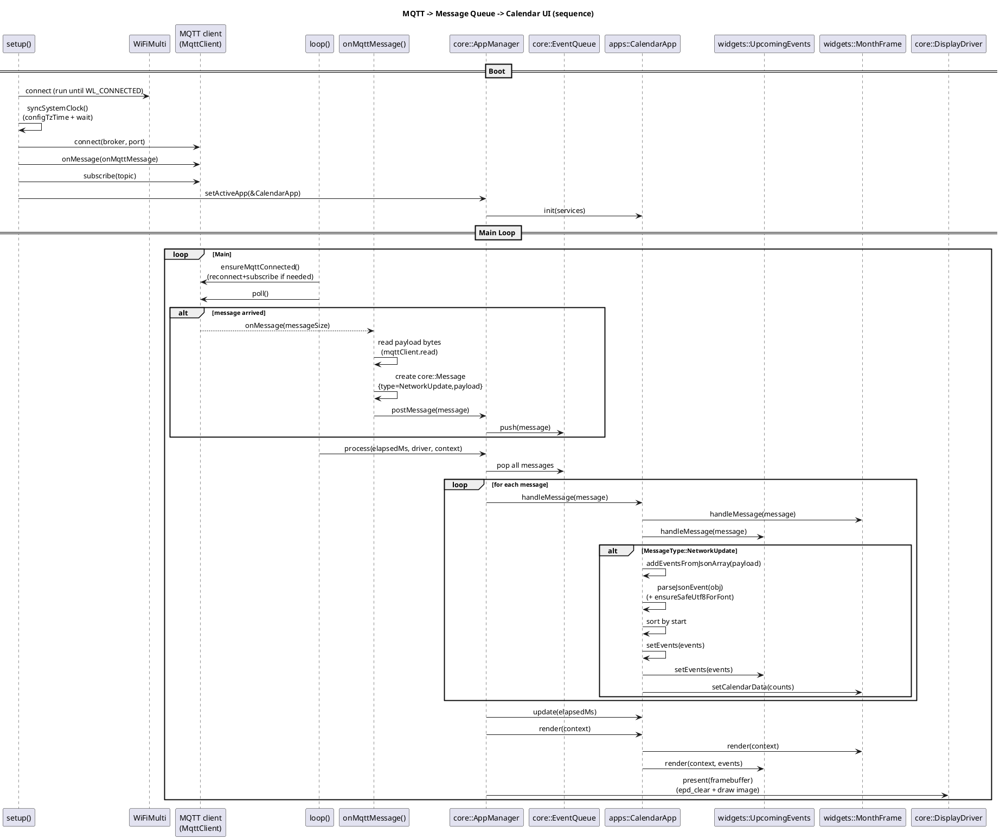

# UML Sequence Diagram 1.0

```plantuml
@startuml
title MQTT -> Message Queue -> Calendar UI (sequence)

skinparam participantStyle rectangle
skinparam sequenceMessageAlign center

participant "setup()" as Setup
participant "WiFiMulti" as WiFi
participant "MQTT client\n(MqttClient)" as MQTT
participant "loop()" as Loop
participant "onMqttMessage()" as Callback
participant "core::AppManager" as AppManager
participant "core::EventQueue" as Queue
participant "apps::CalendarApp" as CalendarApp
participant "widgets::UpcomingEvents" as Upcoming
participant "widgets::MonthFrame" as MonthFrame
participant "core::DisplayDriver" as Driver

== Boot ==
Setup -> WiFi: connect (run until WL_CONNECTED)
Setup -> Setup: syncSystemClock()\n(configTzTime + wait)
Setup -> MQTT: connect(broker, port)
Setup -> MQTT: onMessage(onMqttMessage)
Setup -> MQTT: subscribe(topic)
Setup -> AppManager: setActiveApp(&CalendarApp)
AppManager -> CalendarApp: init(services)

== Main Loop ==
loop Main
  Loop -> MQTT: ensureMqttConnected()\n(reconnect+subscribe if needed)
  Loop -> MQTT: poll()

  alt message arrived
    MQTT --> Callback: onMessage(messageSize)
    Callback -> Callback: read payload bytes\n(mqttClient.read)
    Callback -> Callback: create core::Message\n{type=NetworkUpdate,payload}
    Callback -> AppManager: postMessage(message)
    AppManager -> Queue: push(message)
  end

  Loop -> AppManager: process(elapsedMs, driver, context)
  AppManager -> Queue: pop all messages
  loop for each message
    AppManager -> CalendarApp: handleMessage(message)
    CalendarApp -> MonthFrame: handleMessage(message)
    CalendarApp -> Upcoming: handleMessage(message)

    alt MessageType::NetworkUpdate
      CalendarApp -> CalendarApp: addEventsFromJsonArray(payload)
      CalendarApp -> CalendarApp: parseJsonEvent(obj)\n(+ ensureSafeUtf8ForFont)
      CalendarApp -> CalendarApp: sort by start
      CalendarApp -> CalendarApp: setEvents(events)
      CalendarApp -> Upcoming: setEvents(events)
      CalendarApp -> MonthFrame: setCalendarData(counts)
    end
  end

  AppManager -> CalendarApp: update(elapsedMs)
  AppManager -> CalendarApp: render(context)
  CalendarApp -> MonthFrame: render(context)
  CalendarApp -> Upcoming: render(context, events)
  AppManager -> Driver: present(framebuffer)\n(epd_clear + draw image)
end

@enduml
```

